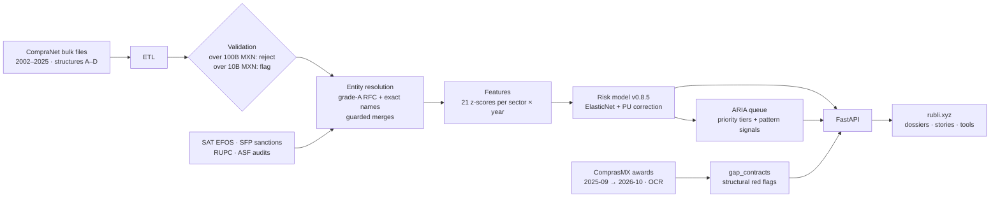

<div align="center">

# RUBLI

**Open corruption-risk indicators for three million Mexican federal contracts.**

[rubli.xyz](https://rubli.xyz) · [Methodology](docs/RISK_METHODOLOGY.md) · [Model card](docs/MODEL_CARD.md) · [Data & limitations](docs/DATA.md) · [Para periodistas](#para-periodistas)

[](https://github.com/rodanaya/rubli/actions/workflows/ci.yml)
[](LICENSE)
[](https://creativecommons.org/licenses/by/4.0/)
[](https://rubli.xyz)

</div>

---

RUBLI ingests every federal contract Mexico published on CompraNet from 2002 to 2025, cleans it, and resolves the companies and agencies behind it. It then scores each contract with a statistical **risk indicator** and ranks vendors into an investigation queue. Reporters, auditors and researchers can use it to decide **where to look first**.

## What it is, and what it isn't

| RUBLI **is** | RUBLI **is not** |
|---|---|
| A triage tool that ranks contracts by how closely they resemble contracts in known cases | A finding, an accusation, or evidence that anyone broke the law |
| A cleaned, entity-resolved copy of public procurement records | A complete record: it covers contract awards, not execution or payment |
| Open code with documented, measured limitations | A validated detector. Its out-of-sample AUC is **0.656**, a modest signal |

> **A high score means "look here", never "this is corrupt".** Scores are risk indicators, not probabilities of corruption. Every lead needs document-based reporting before anything is published about a company or person. Natural persons' tax IDs are never exposed.

## Key numbers

| | |
|---|---|
| Federal contracts (CompraNet) | **3,055,837** · 2002–2025 · ~9.9 trillion MXN |
| Data horizon | **2025-09-28** (feed frozen after CompraNet was abolished; 2025 is partial, 2004 has no source file) |
| Post-CompraNet awards (ComprasMX) | **98,290** procedures, 2025-09-28 → 2026-10-02; **52,537** with OCR-recovered amounts (356.0B MXN). Graded by a separate structural red-flag indicator, not the risk model |
| Canonical buyers / suppliers | **3,462** institutions · **316,967** vendors |
| Risk model | **v0.8.5**: one global ElasticNet logistic regression, 21 sector-year z-score features, PU correction |
| Validation | Forward-holdout AUC **0.656** (vendors labelled after training) · in-sample **0.733**. The originally reported 0.785 could not be reproduced and is withdrawn |
| Flagged share | **11.0%** high or critical · **4.98%** critical. This is a triage threshold, not an estimate of corruption |
| Labelled cases | **1,417**: 361 press · 25 official records · 1 audit · 989 model- or ARIA-surfaced leads written up by analysts · 41 other. Mostly not adjudicated |
| Investigation queue (ARIA) | **248,944** vendors · Tier 1 = 299 (all already labelled cases) · Tier 2 = 1,488 (where new leads start) |

## How it works



1. **Ingest and validate.** CompraNet's four file layouts are normalised into one schema. Amounts above 100 billion MXN are rejected as decimal errors; amounts above 10 billion MXN are flagged.
2. **Resolve entities.** Spelling variants of the same company or agency are merged only on strong evidence: the same high-quality RFC, or the same normalised legal name plus a co-signal. Automatic merges measured 99.46% precision. Natural persons are never merged by name. [Details](docs/DATA.md#4-entity-resolution).
3. **Score.** 21 features (price outliers, vendor concentration, co-bidding structure, timing, amendments and more) are z-scored within sector and year and combined by one logistic model. [Methodology](docs/RISK_METHODOLOGY.md).
4. **Queue.** ARIA combines the score with anomaly measures, contract value and external registries into a vendor priority score and tier. [Spec](docs/ARIA_SPEC.md).
5. **Publish.** A FastAPI backend serves precomputed results to a bilingual (ES/EN) editorial site with dossiers for vendors, institutions, sectors, categories and cases.

## Data

| Source | Coverage | Use |
|---|---|---|
| **CompraNet**, structure A | 2002–2010 · RFC on 0.1% of vendors | Contracts; lowest quality |
| **CompraNet**, structure B | 2010–2017 · RFC 15.7% | Contracts |
| **CompraNet**, structure C | 2018–2022 · RFC 30.3% | Contracts |
| **CompraNet**, structure D | 2023–2025 · RFC 47.4% | Contracts; best quality, budget *partida* codes |
| **ComprasMX** | 2025-09-28 → 2026-10-02 | Post-CompraNet awards, kept in a separate table |
| **SAT** EFOS list (Art. 69-B) | 13,960 entries | Flag only at the definitive stage |
| **SFP** sanctioned suppliers | 2,395 records | Name or RFC match, labelled by match strength |
| **ASF** audits | 692 cases | Linked to buyers via a reviewed crosswalk |

### Known limitations

- **Award data only.** Overruns, kickbacks and ghost deliveries during execution are invisible.
- **2004 is missing** (no source file). **2025 is partial** (ends 2025-09-28).
- **Structure A (2002–2010) is weak**: almost no RFCs and no publication dates, so risk is likely underestimated.
- **About 141K titles from 2003–2010 are garbled** (accented letters became "ý" in the source/ETL). No clean public source exists.
- **Labels are mostly self-generated.** 989 of 1,417 cases were surfaced by the model or ARIA, which creates a feedback loop. Evaluation on independently sourced cases is planned for v0.9.
- **The headline 0.785 AUC is not reproducible.** The split and training script were not preserved. Use 0.656 (forward holdout).
- **`network_member_count`**, an active model feature, still uses an old name-similarity grouping (~19% precision). It will be rebuilt at the next retrain.
- **`institution_diversity` is misnamed**: it is a buyer-concentration index with a negative weight, so single-buyer vendors score lower.

The full table is in [docs/DATA.md](docs/DATA.md#5-known-limitations) and [docs/MODEL_CARD.md](docs/MODEL_CARD.md#5-limitations-and-failure-modes).

## Quickstart

**Frontend only, against the public API (no database needed):**

```bash
cd frontend
npm install
VITE_API_URL=https://rubli.xyz npm run dev     # http://localhost:3009
# PowerShell: $env:VITE_API_URL="https://rubli.xyz"; npm run dev
```

**Full stack** (or `make setup && make backend` / `make frontend`):

```bash
python -m venv .venv && source .venv/bin/activate   # Windows: .venv\Scripts\activate
pip install -r backend/requirements.txt
cd backend
uvicorn api.main:app --port 8001               # run from backend/ — first boot scans the DB (30–60 s)

# in a second terminal, from the repository root
cd frontend
npm install && npm run dev                     # proxies /api to 127.0.0.1:8001
```

**The database is not in this repository.** It is several GB, and the raw registries contain personal data. Build it from the public CompraNet files with the ETL in `backend/scripts/` (`etl_create_schema.py`, `etl_pipeline.py`, then features and aggregates). Ingest is reproducible. Re-creating the v0.8.5 scores exactly is not yet possible: the coefficients are published, but the trainer and one feature builder are missing. The step-by-step guide is in [docs/DEVELOPMENT.md](docs/DEVELOPMENT.md#getting-a-database).

Ground-truth labels are not distributed either; see [docs/GROUND_TRUTH.md](docs/GROUND_TRUTH.md) and [docs/RISK_METHODOLOGY.md](docs/RISK_METHODOLOGY.md) for how they were built.

## Repository map

| Path | Contents |
|---|---|
| [`backend/api/`](backend/api/) | FastAPI application: routers, services, PII masking, rate limiting |
| [`backend/scripts/`](backend/scripts/) | ETL, validation, features, scoring patch, ARIA pipeline, registry and ComprasMX loaders, precomputes |
| [`backend/hyperion/`](backend/hyperion/) | Entity-resolution primitives (normalisation, blocking, similarity) |
| [`backend/data/`](backend/data/) | Small reviewed reference files (ASF crosswalk, institution resolution, seeds) |
| [`backend/tests/`](backend/tests/) | pytest suite |
| [`frontend/`](frontend/) | React + TypeScript + Vite site (ES/EN) |
| [`docs/`](docs/) | Methodology, model card, data, schema, development and deployment guides ([index](docs/README.md)) |
| [`scripts/`](scripts/) | Deployment and operations shell scripts |
| [`Makefile`](Makefile) | `make setup / backend / frontend / test / lint / build` |
| `docker-compose*.yml`, `Caddyfile` | Container setup and TLS reverse proxy |

## Documentation

| | |
|---|---|
| [Risk methodology](docs/RISK_METHODOLOGY.md) | Features, coefficients, thresholds, model history |
| [Model card](docs/MODEL_CARD.md) | Intended use, evaluation, failure modes, monitoring |
| [Ground truth](docs/GROUND_TRUTH.md) | The labelled case set and its provenance |
| [Data](docs/DATA.md) | Sources, validation, entity resolution, limitations |
| [ARIA](docs/ARIA_SPEC.md) | Investigation-queue specification |
| [Development](docs/DEVELOPMENT.md) · [Schema](docs/DATABASE_SCHEMA.md) · [Deployment](docs/DEPLOYMENT.md) | Working on the code |

## Para periodistas

RUBLI es una herramienta gratuita para **priorizar** investigaciones sobre contratación pública federal (2002–2025). No requiere registro: entra a **[rubli.xyz](https://rubli.xyz)**.

- **Qué hace:** asigna a cada contrato un *indicador de riesgo* según su parecido con contratos de casos etiquetados, y ordena a los proveedores en una lista de investigación (ARIA).
- **Qué no hace:** no determina responsabilidades ni prueba corrupción. Una puntuación alta significa «revisa aquí», nunca «esto es corrupto». Verifica con documentos (contratos, actas de fallo, auditorías de la ASF, solicitudes de transparencia) antes de publicar.
- **Cómo citarlo:** «RUBLI, indicador de riesgo en contratación pública (modelo v0.8.5), rubli.xyz». Evita «probabilidad de corrupción» y «casos verificados»: son *casos etiquetados*, y la mayoría no son resoluciones.
- **Límites clave:** solo datos de adjudicación; 2004 sin datos; 2025 parcial (hasta el 28 de septiembre); los registros 2002–2010 casi no tienen RFC. AUC fuera de muestra: 0.656.
- **Materiales:** [guía para periodistas](docs/press/guia_periodistas.md) · [comunicado](docs/press/comunicado_de_prensa.md) · [ficha técnica](docs/press/technical_onepager.md).

¿Encontraste un error en los datos o una vinculación incorrecta? Escríbenos a **rubli-project@proton.me**. Las correcciones sobre empresas o personas tienen prioridad.

## Contributing

Bug reports, data corrections and pull requests are welcome. See [CONTRIBUTING.md](CONTRIBUTING.md) and the [Code of Conduct](CODE_OF_CONDUCT.md). To report a security issue or exposed personal data, follow [SECURITY.md](SECURITY.md) and **do not open a public issue**.

## Citation

If you use RUBLI in research or reporting, please cite it. GitHub's **"Cite this repository"** button reads [CITATION.cff](CITATION.cff).

> RUBLI project (2026). *RUBLI: open corruption-risk indicators for Mexican federal procurement* (model v0.8.5). https://github.com/rodanaya/rubli

## License

- **Code:** [Apache License 2.0](LICENSE).
- **Derived data and outputs** (scores, aggregates, documentation): [Creative Commons Attribution 4.0](https://creativecommons.org/licenses/by/4.0/). Credit "RUBLI".
- **Source records** remain subject to their publishers' terms (CompraNet / SHCP, SAT, SFP, ASF).

## Contact

**rubli-project@proton.me** · [rubli.xyz](https://rubli.xyz) · [Issues](https://github.com/rodanaya/rubli/issues)

## Acknowledgements

Built on public records published by CompraNet and ComprasMX, SAT, SFP and the Auditoría Superior de la Federación, and on the work of the Mexican journalists whose investigations make up much of the labelled case set. Methodological debts: Elkan & Noto (2008) for positive-unlabelled learning, and Fazekas, Tóth & King (2016) for objective procurement risk indicators.
