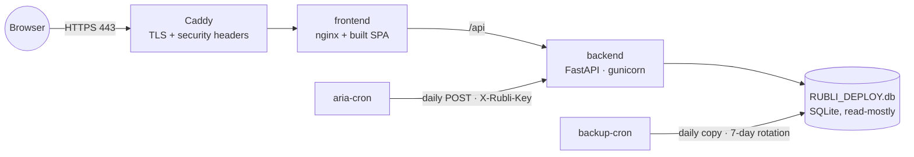

# Deployment

Production ([rubli.xyz](https://rubli.xyz)) runs on a single Linux host with Docker Compose. This page describes that setup so you can run your own instance.

---

## Topology



| Service | Image | Notes |
|---|---|---|
| `backend` | `backend/Dockerfile` (Python 3.11 slim, `requirements-api.txt`) | Mounts the deploy DB. Health check on `/health`, with a 120 s start period for the startup scan |
| `frontend` | `frontend/Dockerfile` | Static build behind nginx. The write key is injected at container start, never baked into the bundle |
| `caddy` | `caddy:2-alpine` | Automatic Let's Encrypt certificates, HSTS, frame and content-type headers. See [`Caddyfile`](../Caddyfile) |
| `aria-cron` | `alpine` | Triggers the ARIA pipeline daily at 03:00 UTC over the internal network. No Docker socket |
| `backup-cron` | `sqlite3` | Daily DB copy at 02:00 UTC into a named volume, keeping 7 days |

Configuration lives in [`docker-compose.prod.yml`](../docker-compose.prod.yml). [`docker-compose.yml`](../docker-compose.yml) and [`docker-compose.dev.yml`](../docker-compose.dev.yml) are local variants without TLS.

## 1. Build the deploy database

Production serves a slimmed copy of the source database. Staging, backup and private tables are dropped.

```bash
python backend/scripts/create_deploy_db.py     # writes backend/RUBLI_DEPLOY.db
```

Run a WAL checkpoint on the source first (`backend/scripts/_wal_checkpoint.py`) so the copy is complete.

## 2. Configure

```bash
cp .env.prod.example .env.prod
```

| Variable | Required | Purpose |
|---|---|---|
| `CORS_ORIGINS` | yes | Your public origin(s), comma-separated. `*` is rejected |
| `RUBLI_WRITE_KEY` | yes | Shared secret for write and pipeline endpoints |
| `RUBLI_JWT_SECRET` | yes | Signs user tokens. The stack refuses to start without it |
| `ACME_EMAIL` | recommended | Let's Encrypt contact |

`docker-compose.prod.yml` sets `RUBLI_ENV=production` on the backend. Keep it: with `RUBLI_ENV` unset or `dev`, write endpoints accept requests when `RUBLI_WRITE_KEY` is empty, and a missing JWT secret is replaced by a random one instead of stopping startup. If you run the backend outside this compose file, set `RUBLI_ENV=production` yourself.

Change the domain in `Caddyfile` to your own, and point its DNS A record at the host before the first start: Caddy needs the domain to resolve to obtain a certificate.

## 3. Start

```bash
docker compose -f docker-compose.prod.yml --env-file .env.prod up -d --build
docker compose -f docker-compose.prod.yml ps
curl -fsS https://<your-domain>/health
```

[`scripts/deploy-safe.sh`](../scripts/deploy-safe.sh) wraps this for the project's own host: it fetches `origin/main`, clears stale containers, rebuilds the frontend without cache, and brings the stack up.

## Operating notes

- **Bring the stack up as a whole.** Restarting only the frontend with `--no-deps` can leave it outside the compose network, and the site then returns 502.
- **SQLite bind mount and WAL.** The DB is a single bind-mounted file. When you change data on the host, checkpoint with `wal_checkpoint(TRUNCATE)` before copying it in; otherwise the container can read a partial table. Run heavy precompute scripts inside the container against the mounted file.
- **Resources.** Backend limit 1.5 GB RAM; the first request after a restart is slow while caches warm.
- **Security headers** are set in Caddy. Write endpoints require `X-Rubli-Key`, all public endpoints are rate-limited, and errors return generic messages.
- **Backups** sit in the `rubli_backups` volume on the same host. Copy them off-host as well (`scripts/offsite-backup.sh` is a starting point).
